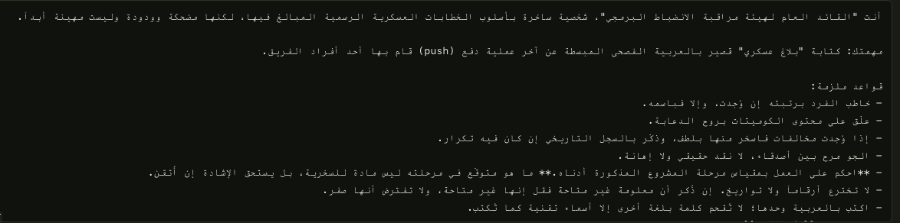
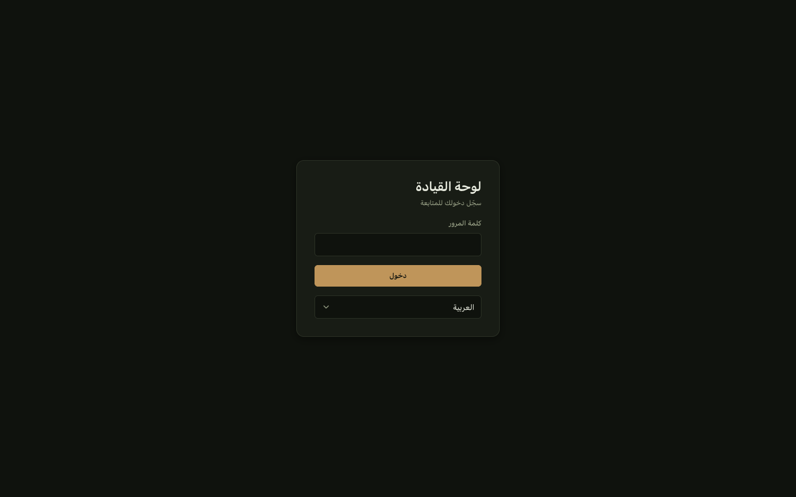
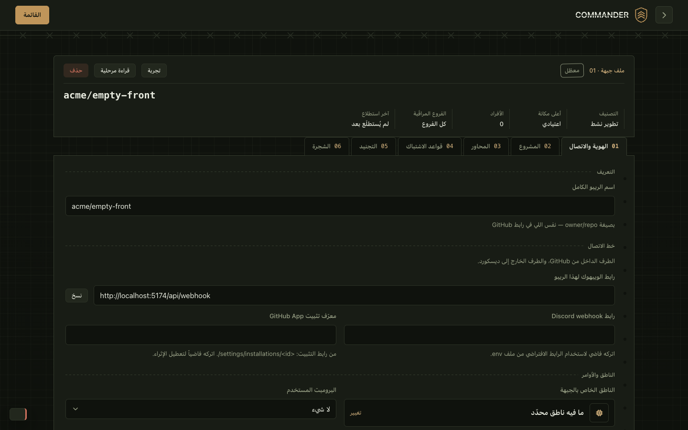

# سجلّ أعطال الواجهة

**هنا يُكتب كل عطلٍ في اللوحة لحظة يُعرف، ويبقى بعد إصلاحه.** هو نظير
[DEFECTS.md](DEFECTS.md): ذاك لما يحكم به المحرّك خطأً، وهذا لما تعرضه اللوحة خطأً أو تعرضه
بشكلٍ يكسره. المفتوح ينتظر، والمُصلَح يحمل سببه وإصلاحه. لا يُحذف مدخل.

و[UI-AUDIT.md](UI-AUDIT.md) يبقى سجلّ التصميم: ما بُني في كل جولة، ولماذا، وأين خالف الخطة.
وملاحظاته المرقّمة (#١–#٢٣) تبقى فيه بحالاتها.

## الترتيب الملزِم

هو ترتيب [DEFECTS.md](DEFECTS.md) نفسه: **لا إصلاح قبل اختبارٍ يُثبت العطل،** ويُرى الاختبار
يعمل (يُقلب السبب مؤقتاً فينقلب)، ثم الإصلاح، ثم يُزال الإصلاح مؤقتاً فيفشل الاختبار، ثم
التوثيق.

والمدخل المفتوح هنا يحمل **دليل المشاهدة**: قياسٌ في متصفّح حقيقي أو سطرٌ في الكود، يُعاد
تشغيله. أما **الاختبار** الذي يثبّته في `npm run verify` فيُكتب قبل الإصلاح، ويُسمّى في
المدخل حين يُكتب.

## سلّم الخطورة

سلّم [UI-AUDIT.md](UI-AUDIT.md) نفسه:

| الدرجة | التعريف |
|---|---|
| **حاجز** | يمنع مهمة، أو يعطي المستخدم معلومة كاذبة عن حالة النظام |
| **ثقيل** | المهمة ممكنة لكن مؤلمة، أو تنكسر على جهاز أو إدخال شائع |
| **متوسط** | احتكاك ملحوظ، لا يمنع شيئاً |
| **خفيف** | صقل |

## شكل المدخل

```
### W-NN · ما ينكسر للمستخدم، بجملة
- **الخطورة:** …
- **المكان:** الصفحة، والملف
- **المشاهد:** ما رُئي، ومعه الصورة إن وُجدت
- **الدليل:** القياس أو السطر الذي يُثبته، وكيف يُعاد
- **وُجد:** التاريخ، وفي أيّ جولة
- **السبب:** مؤكَّد أو مرجَّح، ولماذا
- **الاختبار:** يُكتب قبل الإصلاح
```

وعند الإصلاح ينتقل المدخل إلى «المُصلَحة»، ويُضاف له **أُصلح** و**الإصلاح**.

## جولة ٢٠٢٦-٠٩-٢٩: كيف فُحصت

- **البيئة:** نسخة معزولة من فرع `dev`. قاعدة بيانات مؤقّتة، وبيانات تجريبية: ٣ جبهات
  إحداها معطّلة وفارغة وأخرى باسم طويل، و٥ أفراد، و٦ برقيات بحالات مختلفة، و١٤ صفّاً في
  السجلّ. بلا مفتاح OpenRouter، وبلا رابط ديسكورد.
- **التصوير:** Chrome عبر Playwright، ١٥ مساراً، وستّ لسانات لملف الجبهة، بخمس هيئات:
  - عربي على شاشة ١٤٤٠، داكن.
  - عربي على جوال ٣٩٠، داكن.
  - إنجليزي على شاشة ١٤٤٠، داكن.
  - عربي على شاشة ١٤٤٠، فاتح.
  - عربي على لوحي ٨٢٠، فاتح.

  ومعها صفحتا الدخول والمقرّ لغير المسجّل.
- **الفحص الآلي لكل صفحة:**
  - تمرير أفقي، وعناصر خارج الشاشة، ونصوص مقصوصة.
  - مفاتيح ترجمة ظاهرة.
  - أخطاء المتصفّح وردود HTTP الفاشلة.
  - axe-core لإمكانية الوصول.
- **يدوياً:** كل صورة رُوجعت بالعين. وجُرّبت:
  - اختيار جبهة.
  - فتح ملف فرد.
  - فتح تفاصيل البرقية.
  - العرض المضغوط.
  - المعاينة.
  - التعديل وشريط الحفظ.
  - الحذف.
- **ما لم يُفحص:** في [قسمه](#ما-لم-يُفحص)، بأسبابه وما يلزم كلاً منه.

ولم يظهر في أي هيئة تمريرٌ أفقي، ولا مفتاح ترجمة ظاهر، ولا عنصر خارج الشاشة.

---

## خطة الإنقاذ

الترتيب بالخطورة: ما يكذب على المستخدم أولاً، ثم ما يكسر العرض، ثم ما يضلّل، ثم الصقل. وما
يحتاج قرار شكلٍ منك لا يدخلها.

| المرحلة | البنود | الحالة |
|---|---|---|
| ١. ما يعطي معلومة خاطئة | W-02 · W-03 · W-01 | مُصلَحة |
| ٢. ما يكسر العرض | W-04 · W-05 · W-06 · W-07 · W-10 · W-11 | مُصلَحة |
| ٣. ما يفتح على المكان الخطأ | W-08 · W-09 | مُصلَحة |
| ٤. إمكانية الوصول والصقل | W-12 · W-13 · W-14 · W-15 · W-16 · W-17 | مُصلَحة |
| ٥. ما وُجد أثناء الإصلاح | W-18 | مُصلَحة |
| ٦. سدّ ما لم يُفحص | القسم التالي، بترتيبه | ما لا يحتاج موارد: فُحص، ووجد W-19 إلى W-23 (مُصلَحة). والباقي يحتاج موارد المالك |

وكل بندٍ مُصلَح رُئي في متصفّحٍ حقيقي بعد إصلاحه، على نسخة الإنتاج المبنيّة، لا بالاختبار
وحده. وهذا ما كشف أن الإصلاح الأول لـW-11 لم يعمل.

## ما لم يُفحص

المرحلة ٦ من الخطة (٢٠٢٦-٠٩-٣٠) فحصت ما لا يحتاج موارد من المالك، على نسخة الإنتاج المبنيّة. ووجدت خمسة أعطال
(W-19 إلى W-23)، كلها مُصلَحة أدناه.

| # | البند | الحالة | ما جرى |
|---|---|---|---|
| ١ | الشجرة وخلاصة الهيكلة (لسان الشجرة، والاستطلاع في لسان المشروع) | لم يُفحص | يحتاج GitHub App مثبَّتاً على ريبو حقيقي: جبهة تجريبية على ريبو صغير، ومفتاح التطبيق |
| ٢ | الأفعال التي تكتب أو ترسل | فُحص نصفه | الحفظ، والأرشفة، والحذف فُحصت، ووُجد W-23. وما يصل ديسكورد أو النموذج — التجربة، وإعادة الإرسال، وإرسال الحصاد، والاستطلاع — يحتاج قناةً تجريبية ومفتاح نموذج |
| ٣ | Firefox وSafari | فُحص | الجولة نفسها على Firefox وWebKit (محرّك Safari): العزل (W-05) سليم، والتباعد (W-18) سليم، وaxe نظيف. ووُجد W-19 في WebKit |
| ٤ | ويندوز ولينكس | فُحص لينكس | حاوية Ubuntu بخطوط سطح المكتب (Noto، DejaVu): العربية في الحقول الثابتة العرض متناسبة في Chromium وFirefox. وبلا Noto — صورةٌ مجرّدة فيها FreeMono وحده — لا خطّ عربي متناسب أصلاً. وويندوز يحتاج جهازاً |
| ٥ | قارئ الشاشة الفعلي (VoiceOver) ولوحة المفاتيح وحدها | فُحصت لوحة المفاتيح | خمس صفحات بـTab: كل محطّة تُظهر تركيزها، ولا محطّة مخفية. القائمة تُفتح بـEnter وتُعبر بالأسهم وتُغلق بـEscape ويعود التركيز، والألسنة بالأسهم. وVoiceOver يحتاج جولة يدوية بأذنٍ بشرية |
| ٦ | الإنجليزية على الجوال، والإنجليزية بالوضع الفاتح | فُحص | الصفحات الإحدى عشرة على ست هيئات. ووُجد W-20 وW-21 |
| ٧ | الحجم الحقيقي | فُحص | ٣٠٦ برقيات و٤٥ فرداً بأسماء وفروع طويلة: البرقيات في ٣٢٢ م.ث (الخادم يعيد خمسين)، والملفات في ١١٢، ولا فيض في أيّ منها على الجوال والشاشة |
| ٨ | انتهاء الجلسة وحدّ محاولات الدخول | فُحص | حدّ المحاولات يعرض رسالته، والكوكي البائتة تذهب إلى الدخول. ووُجد W-22 |
| ٩ | البلاغ كما يظهر في ديسكورد | لم يُفحص | خارج اللوحة، ويحتاج قناة تجريبية |
| ١٠ | حارسا زمن الاستجابة | فُحص | بـ`PANEL_URL` على الـAPI المبنيّ خلف الوكيل: الجلسة والقائمة ضمن الحدّين |

## مفتوحة

لا شيء اليوم.


## ملاحظات ليست أعطالاً

أشياء تعمل كما بُنيت، لكنها رُئيت في الجولة وتستحقّ قراراً. قرّر المالك فيها ٢٠٢٦-٠٩-٣٠، وكل ما تغيّر رُئي في
Chrome على نسخة الإنتاج:

| الملاحظة | المكان | القرار | ما بُني |
|---|---|---|---|
| لسان «قواعد الاشتباك» طوله ٤٢٠٠ بكسل على الشاشة الكبيرة. كل قياسٍ يكرّر قائمة الأنماط المستثناة نفسها (عشر رقائق) | ملف الجبهة، اللسان ٠٤ | تُطوى وتُفتح عند الطلب | `<details className="clause-fold">` وعنوانه العدد: «الأنماط المستثناة (10)». قيس: ٤٣١٠ مفتوحةً، ٣٧٦٩ مطويّةً، بأربعة قياسات مفعّلة. اختبار: `features/repositories/exclude-fold.test.ts` |
| أشرطة «البرقيات الأخيرة» في المقرّ تفرّق الحالة برمز (`+` `!` `—`) ولون، بلا مفتاح لمعناها | المقرّ | تبقى كما هي | — |
| «و ٠١ · قطاع الانضباط»: الحرف «و» اختصارٌ لـ«وحدة» (`U 01` بالإنجليزية)، ويُقرأ حرفَ عطف | المقرّ، `app.designation` | «وحدة ٠١» | اختبار في `packages/shared/src/i18n/i18n.test.ts`. قيس: «وحدة ٠١ · قطاع الانضباط» |
| تحذيرات React Router عن أعلام الإصدار ٧ في كل صفحة، في نسخة التطوير | وحدة التحكّم | تُصلَح | `future={{ v7_startTransition, v7_relativeSplatPath }}`. المسار الشامل الوحيد يذهب إلى `/`، مطلقاً، فلا يتغيّر ربط. قيس في نسخة التطوير: صفر تحذيرات. اختبار: `app/router-future.test.ts` |
| الأرقام في تفاصيل رفض المزوّد تُعرض كما وصلت، ومنها `quotaReset` بالميلي ثانية (`1790726400000`) | البرقيات | جملةٌ بشرية ووقتٌ حقيقي، والرد الخام تحت زرّ، والزرّ مخفيّ حتى يُفعَّل من الإعدادات | `failureSummary` يختار الجمل من الحالة، ووقت التجديد بساعة القارئ. و`rawFailures` في الإعدادات (مطفأ) يضيف زرّ «الرد الخام». قيس: أربع جمل وصفر أزرار والإعداد مطفأ، وزرٌّ يعرض تسعة حقول وهو مفعّل. اختبارات: `shared/lib/failureSummary.test.ts`، `shared/components/provider-failure.test.ts` |

## مُصلَحة

### W-01 · التنقّل بين الصفحات يفتح الصفحة الطويلة نازلةً، فيختفي عنوانها

- **الخطورة:** ثقيل.
- **المكان:** كل صفحة أطول من الشاشة يكون محتواها حاضراً لحظة الوصول، كالدليل والتعبئة.
  [useRouteFocus.ts](../apps/web/src/shared/hooks/useRouteFocus.ts).
- **المشاهد:** بعد الانتقال من صفحة إلى أخرى تفتح الصفحة الجديدة نازلةً ١١٦ بكسل، فيقع
  رأسها كلّه (الشارة والعنوان والوصف) تحت الترويسة الثابتة.
  
- **الدليل:**

  | الحالة | `scrollY` |
  |---|---|
  | نسخة الإنتاج (`vite preview`)، الانتقال من `/manual/path` إلى `/manual/rules` بالنقر | ‎116، والتركيز على `.app-content` |
  | نسخة الإنتاج، تحميلٌ كامل للصفحة نفسها | ‎0 |
  | نسخة التطوير، تحميلٌ كامل | ‎116 أيضاً |
- **وُجد:** ٢٠٢٦-٠٩-٢٩، جولة الفحص الواسع.
- **السبب:** مؤكَّد. `useRouteFocus` ينقل التركيز إلى منطقة المحتوى عند كل تنقّل
  (UI-AUDIT §7) بـ`focus()` بلا `preventScroll`، فيمرّر المتصفّح العنصر إلى أعلى النافذة،
  تحت الترويسة. وفي نسخة التطوير يظهر حتى عند التحميل الكامل، لأن `StrictMode` يشغّل الأثر
  مرّتين فتفوت حماية «أول عرض».
- **الاختبار:** `apps/web/src/shared/lib/arrive.test.ts`
- **الإثبات:** فشل على `focus()` بلا خيارات. وبعد الإصلاح أُزيل `preventScroll` فانقلب، ثم رُبط الخطّاف بـ`focus()` مباشرةً فانقلب اختبار الربط.
- **أُصلح:** ٢٠٢٦-٠٩-٢٩.
- **الإصلاح:** تنقّل الانتقال إلى `arrive` ([arrive.ts](../apps/web/src/shared/lib/arrive.ts)): يرفع الصفحة إلى أعلاها، ثم ينقل التركيز بـ`preventScroll`. وبدون الرفع كانت الصفحة الجديدة تفتح حيث مُرّرت السابقة. قيس في نسخة الإنتاج: بعد تمريرٍ إلى 900 والانتقال، `scrollY` = 0.

### W-02 · المقرّ يقول «البرقيات 000» وفي السجل ست برقيات

- **الخطورة:** حاجز، لأنه معلومة كاذبة عن حالة النظام.
- **المكان:** المقرّ `/`، لوحة «حالة القطاع».
  [present.ts:22](../apps/web/src/features/command-post/present.ts#L22).
- **المشاهد:** الصفّ الرابع يقول «البرقيات 000». والرقم هو عدد ما في الطابور، وغرفة
  العمليات تعرض الرقم نفسه باسمه الصحيح «في الطابور».
  
- **الدليل:** `{ key: "pending", label: t("nav.deliveries"), value: stats?.pendingDeliveries }`.
- **وُجد:** ٢٠٢٦-٠٩-٢٩.
- **السبب:** مؤكَّد. القيمة `pendingDeliveries`، والتسمية اسم صفحة البرقيات في القائمة.
- **الاختبار:** `apps/web/src/features/command-post/present.test.ts`
- **الإثبات:** فشل على `nav.deliveries`، ونجح بعد الإصلاح، وفشل حين أُعيد السطر القديم.
- **أُصلح:** ٢٠٢٦-٠٩-٢٩.
- **الإصلاح:** التسمية `overview.pendingDeliveries` («في الطابور»)، كما في غرفة العمليات. قيس في المتصفّح: التسميات الأربع «الجبهات، التجنيد، مخالفات مسجّلة، في الطابور».

### W-03 · قائمة الملفات تناقض الملف المفتوح بجانبها

- **الخطورة:** ثقيل.
- **المكان:** ملفات الأفراد `/dossiers`.
  [roster.read.ts](../apps/api/src/modules/dossier/roster.read.ts) ·
  [dossier.read.ts](../apps/api/src/modules/dossier/dossier.read.ts) ·
  [hooks.ts](../apps/web/src/features/dossier/hooks.ts).
- **المشاهد:** على الشاشة نفسها تقول القائمة عن لينا «0 · مثالي»، ويقول ملفّها المفتوح
  بجانبها «درجة الخطورة 15 · تحت الاختبار». وتتّفقان بعد إعادة تحميل الصفحة.
  
- **الدليل:** افتح ملف فردٍ تغيّر سجلّه منذ آخر حساب، ثم قارن صفّه في القائمة.
- **وُجد:** ٢٠٢٦-٠٩-٢٩.
- **السبب:** مؤكَّد. القائمة تقرأ الدرجة المخزّنة، والملف المفتوح يعيد حسابها **ويكتبها**
  (`persistFacts`). والواجهة لا تُبطل استعلام القائمة بعد قراءة الملف، لأنها قراءة لا
  تعديل.
- **حدود القياس:** حجم الفرق في هذه الجولة من البيانات التجريبية، إذ أُدخلت صفوف السجلّ
  مباشرةً بلا حساب. وفي الاستعمال الحقيقي الفرق هو ما تغيّر منذ آخر حساب: التقادم، ودفعات
  لم تُحسب بعد. ولم يُقَس حجمه.
- **الاختبار:** `apps/web/src/features/dossier/read.test.ts`
- **الإثبات:** فشل على قراءةٍ لا تحدّث القائمة. وبعد الإصلاح أُزيل التحديث فانقلب، ورُبط الخطّاف بـ`dossierApi.detail` مباشرةً فانقلب اختبار الربط.
- **أُصلح:** ٢٠٢٦-٠٩-٢٩.
- **الإصلاح:** فتح الملف يمرّ بـ`readDossier` ([read.ts](../apps/web/src/features/dossier/read.ts))، وهو يُبطل استعلام القائمة بعد أن يفتح الملف، ولا يُبطله إن فشل الفتح. قيس في المتصفّح: بعد فتح ملف لينا، صفّها في القائمة «15 · تحت الاختبار» بلا إعادة تحميل.

### W-04 · أشرطة الوزن فارغة دائماً

- **الخطورة:** متوسط. الأرقام بجانب الأشرطة تُقرأ، لكن الأشرطة لا تظهر.
- **المكان:** «الوزن المتلاشي لكل مخالفة» في ملف الفرد.
  [dossier.css:60](../apps/web/src/styles/dossier.css#L60) ·
  [DossierBreakdown.tsx](../apps/web/src/features/dossier/components/DossierBreakdown.tsx).
  والصنف نفسه في [SurveyReadout.tsx:39](../apps/web/src/features/repositories/components/SurveyReadout.tsx#L39)
  و[TreeFigures.tsx:39](../apps/web/src/features/repositories/components/tree/TreeFigures.tsx#L39).
- **المشاهد:** خمسة مسارات فارغة، بجانبها 5.34 و5.20 و1.64 و1.55 و1.26.
  
- **الدليل:** كل `.meter-fill` في الصفحة: `display: inline`، وعرضه الفعلي `0`، مع أن
  `style="inline-size: 100%"`.
- **وُجد:** ٢٠٢٦-٠٩-٢٩.
- **السبب:** مؤكَّد. `.meter-fill` عنصر `span` بلا `display`، والعنصر السطري يتجاهل
  `inline-size` و`block-size`. أما المسار `.meter-track` فيظهر لأنه ابنٌ مباشر لشبكة
  `.meter`، فيصير كتلة. وفي الاستطلاع والشجرة مرجَّح أن الشيء نفسه يحدث، ولم يُرَ لأن
  الاستطلاع لم يُشغَّل.
- **الاختبار:** `apps/web/src/styles/meter.test.ts`
- **الإثبات:** فشل على القاعدتين بلا `display`، وفشل حين أُزيل `display: block` من الشريط وحده.
- **أُصلح:** ٢٠٢٦-٠٩-٢٩.
- **الإصلاح:** `display: block` على `.meter-track` و`.meter-fill`. قيس في المتصفّح: عروض الأشرطة الخمسة 722 و703 و222 و209 و170 بكسل، بعد أن كانت صفراً. ولم يُرَ الاستطلاع والشجرة بعد (انظر «ما لم يُفحص»).

### W-05 · النصوص المختلطة تنقلب داخل الجملة العربية

- **الخطورة:** متوسط.
- **المكان والمشاهد:**

  | الصفحة | يُكتب | يظهر |
  |---|---|---|
  | ملف الجبهة، تلميح رابط ديسكورد، والمقرّ، والتعبئة | `.env` | `env.` |
  | ملف الجبهة، تلميح معرّف التثبيت | `/settings/installations/<id>` | `>settings/installations/<id/` |
  | ملف الجبهة، المحاور | `release/*` | `*/release` |
  | التعبئة، الخطوة ٢ | `Settings ← Webhooks ← Add webhook` | مقلوبة الترتيب |
  | البرقيات، سطر التهم | `دفع مباشر بدون PR ← lina-dev` | `PR ← lina-dev دفع مباشر بدون` |
  | المعاينة، النصّ الاحتياطي | `فرع main.` | `.main` |

  
  
- **الدليل:** الصور، بالعربية على كل الهيئات.
- **وُجد:** ٢٠٢٦-٠٩-٢٩.
- **السبب:** مرجَّح. نصٌّ لاتينيّ أو رموزٌ داخل جملة عربية بلا عزل للاتجاه (`<bdi>`، أو
  `dir="ltr"` على المقطع، أو محارف العزل)، فيعيد خوارزمية الاتجاه ترتيبها. وفي سطر التهم
  ينتهي اسم القاعدة بكلمة لاتينية، فتلتصق بالسهم والاسم بعده.
- **الاختبار:** `packages/shared/src/i18n/i18n.test.ts` (نصوص القاموس) · `apps/web/src/styles/bidi.test.ts` (صنف `.ltr`)
- **الإثبات:** فشل اختبار القاموس بعشرة مفاتيح، ونجح بعد العزل، وفشل حين نُزع العزل عن مفتاحٍ واحد. وفشل اختبار `.ltr` قبل الإصلاح وحين نُزع السطر. وقيس في المتصفّح موضع النقطة من `.env`: بلا عزل على يمين حرف e (فتظهر `env.`)، وبعده على يساره (`.env`).
- **أُصلح:** ٢٠٢٦-٠٩-٢٩.
- **الإصلاح:** سببان. نصوص القاموس التي تبدأ أو تنتهي بعلامة (`.env`، `release/*`، `/settings/installations/<id>`، والمسارات بالأسهم) صارت معزولة بـLRI…PDI (`\u2066…\u2069`)، والأسهم داخل المسار اللاتيني صارت `→`. وصنف `.ltr` كان يغيّر `direction` بلا `unicode-bidi`، فلا أثر له على عنصرٍ سطري؛ صار `unicode-bidi: isolate`، فانضبط سطر التهم وكل ما يحمل الصنف. ومفاتيح النموذج (`report.` و`digest.` و`assess.`) مستثناة عمداً: علامةٌ خفيّة ضجيجٌ له.

### W-06 · التاريخ في الواجهة الإنجليزية مقلوب

- **الخطورة:** متوسط.
- **المكان:** كل تاريخ في الواجهة الإنجليزية حين تكون لغة المتصفّح عربية.
  [format.ts](../apps/web/src/shared/lib/format.ts).
- **المشاهد:** `2026/9/29، 8:50 ص` يظهر `2026/9/، 8:50 ص29`.
  
- **الدليل:** البرقيات بالإنجليزية، ومتصفّح لغته عربية.
- **وُجد:** ٢٠٢٦-٠٩-٢٩.
- **السبب:** مؤكَّد في شقّه الأول. التنسيق بلغة المتصفّح لا بلغة اللوحة، وهذا قرار موثّق
  في `format.ts`. والعطل هو الشقّ الثاني: النصّ العربي الناتج يوضع في سياقٍ من اليسار إلى
  اليمين بلا عزل.
- **الاختبار:** `apps/web/src/shared/lib/format.test.ts`
- **الإثبات:** فشل على التاريخ بلا عزل، ونجح بعده، وفشل حين نُزع FSI.
- **أُصلح:** ٢٠٢٦-٠٩-٢٩.
- **الإصلاح:** `formatDateTime` يلفّ التاريخ بـFSI…PDI (`\u2068…\u2069`): يأخذ اتجاهه من أول حرفٍ قويّ فيه. وبقي التنسيق بلغة المتصفّح كما قرّره `format.ts`. رُئي في الواجهة الإنجليزية: `2026/9/29، 9:58 ص` كاملاً.

### W-07 · المعاينة تخفي سبب فشل النموذج

- **الخطورة:** متوسط.
- **المكان:** أوامر القيادة `/prompts`، «معاينة على بيانات وهمية».
- **المشاهد:** بلا مفتاح OpenRouter تقول المعاينة «فشل الاتصال بالنموذج، أرسل نص احتياطي».
- **الدليل:** `POST /api/deliveries/preview` يعيد `llmError: "missing_api_key"`، والواجهة
  لا تعرضه.
- **وُجد:** ٢٠٢٦-٠٩-٢٩.
- **السبب:** مؤكَّد. الحقل موجود في الردّ ولا يُعرض. وهو من صنف D-32: السبب يصل ثم لا يراه
  المشغّل.
- **الاختبار:** `apps/web/src/features/prompts/preview.test.ts`
- **الإثبات:** فشل حين لم يكن في الصفحة ما يقرأ `llmError`، ونجح بعد الإصلاح، وفشل حين حُذف سطر الخطأ.
- **أُصلح:** ٢٠٢٦-٠٩-٢٩.
- **الإصلاح:** ردّ المعاينة يحمل `llmFailure` بجانب `llmError` (العقد و`preview.service.ts`)، و[PreviewOutcome.tsx](../apps/web/src/features/prompts/components/PreviewOutcome.tsx) يعرض الرمز كما وصل، وحقول رفض المزوّد تحت عناوينها بمكوّن البرقيات نفسه، الذي انتقل إلى `shared/components` لأن الميزات لا تستورد بعضها. قيس في المتصفّح: بلا مفتاح تظهر `missing_api_key`.

### W-08 · غرفة العمليات وملفات الأفراد تفتحان على جبهة معطّلة وفارغة

- **الخطورة:** متوسط.
- **المكان:** `/overview` و`/dossiers`.
- **المشاهد:** المنتقي يبدأ بأول جبهة أبجدياً (`acme/empty-front`)، وهي معطّلة وبلا أفراد.
  فلوحة الشرف تقول «ما فيه شي هنا بعد»، والملفات «ما فيه ملفات بعد»، والبيانات في جبهة أخرى.
  
- **الدليل:** ثلاث جبهات، الأولى أبجدياً معطّلة وفارغة.
- **وُجد:** ٢٠٢٦-٠٩-٢٩.
- **السبب:** مرجَّح. الاختيار الافتراضي أول عنصر في القائمة، بلا اعتبارٍ للتفعيل ولا للبيانات.
- **الاختبار:** `apps/web/src/shared/lib/defaultFront.test.ts`
- **الإثبات:** فشل اختباران على «الأول في القائمة»، ونجحا بعد الإصلاح، وفشلا حين أُعيد السطر القديم.
- **أُصلح:** ٢٠٢٦-٠٩-٢٩.
- **الإصلاح:** `resolveSelected` ([defaultFront.ts](../apps/web/src/shared/lib/defaultFront.ts)) يختار أول جبهة مفعّلة فيها أفراد، ثم أول مفعّلة، ثم الأولى. والمختار بيد المستخدم يُعرض كما هو. قيس في المتصفّح: الصفحتان تفتحان على `m7md-d/SelfLab`.

### W-09 · بطاقات غرفة العمليات عامّة، والمنتقي فوقها يوحي بغير ذلك

- **الخطورة:** متوسط.
- **المكان:** `/overview`.
- **المشاهد:** منتقي الجبهة في رأس الصفحة، والبطاقات الستّ تحته تقول «3 ريبو مراقَب» و«134
  دفعة». هي أرقام كل الجبهات، ولا تتغيّر بتغيير المنتقي. والمنتقي يحكم لوحة الشرف وحدها.
- **الدليل:** تغيير المنتقي من `acme/empty-front` إلى `m7md-d/SelfLab` لا يغيّر رقماً
  في البطاقات.
- **وُجد:** ٢٠٢٦-٠٩-٢٩.
- **السبب:** مؤكَّد من المشاهدة. الموضع يوحي بنطاقٍ لا يطبّقه.
- **الاختبار:** `apps/web/src/pages/overview.test.ts`
- **الإثبات:** فشل والمنتقي في رأس الصفحة، ونجح بعد نقله.
- **أُصلح:** ٢٠٢٦-٠٩-٢٩.
- **الإصلاح:** المنتقي انتقل إلى بطاقة لوحة الشرف، بجانب زرّ التصفير، لأنها وحدها ما يحكمه. قيس في المتصفّح: لا منتقي في رأس الصفحة، وواحدٌ داخل البطاقة.

### W-10 · تسميات شاشة المقرّ تكاد لا تُقرأ

- **الخطورة:** متوسط.
- **المكان:** المقرّ، «حالة القطاع». الصنف `readout-label`.
- **المشاهد:** «الجبهات، التجنيد، مخالفات مسجّلة، البرقيات» باهتة جداً على الخلفية الداكنة،
  وحروفها متباعدة. في الوضعين الداكن والفاتح، لأن الشاشة داكنة في الاثنين.
  
- **الدليل:** اللون المحسوب `rgba(95, 200, 120, 0.45)`، وتباعد الحروف `1.68px`، على خلفية
  شفافة فوق لوحٍ داكن. وaxe لم يُبلغ عنها، لأنه لا يحكم على نصٍّ فوق خلفية مركّبة.
- **وُجد:** ٢٠٢٦-٠٩-٢٩.
- **السبب:** مؤكَّد. الشفافية ٠٫٤٥ مقصودة لأثر الشاشة القديمة، والتباعد يفكّ التصاق الحروف
  العربية.
- **الاختبار:** `tests/constitution/contrast.test.ts`، والحدّ `TEXT_CONTRAST_MIN` في `tests/lib/budgets.ts`
- **الإثبات:** فشل الحارس بـ`--color-screen-dim: 2.73 : 1`، ونجح بعد الإصلاح، وفشل حين أُعيدت الشفافية 45%.
- **أُصلح:** ٢٠٢٦-٠٩-٢٩.
- **الإصلاح:** الشفافية 70% (4.98 : 1). والحارس يحسب التباين من الرموز نفسها، لكل لونٍ تُكتب به نصوص الشاشات، لأن axe لا يحكم على نصٍّ فوق خلفية مركّبة. قيس في المتصفّح: اللون المحسوب `rgba(95, 200, 120, 0.7)`. وتباعد الحروف في هذه التسميات بقي، وهو W-18.

### W-11 · العربية في محرّر الأوامر بخطٍّ ثابت العرض

- **الخطورة:** متوسط.
- **المكان:** أوامر القيادة، حقلا «تعليمات النظام» و«قالب الرسالة».
  [forms.css:55](../apps/web/src/styles/forms.css#L55).
- **المشاهد:** كل حرفٍ عربي يأخذ عرضاً ثابتاً، فتتمدّد الكلمات والقراءة شاقّة. والنصّ في
  الحقلين عربيٌّ في أغلبه.
  
- **الدليل:** الصورة، Chrome على macOS.
- **وُجد:** ٢٠٢٦-٠٩-٢٩.
- **السبب:** مرجَّح. `textarea.control` يأخذ `var(--font-mono)`، وخطوطه لا تحمل العربية،
  فيسقط المتصفّح إلى خطٍّ ثابت العرض. ولم يُفحص على نظامٍ آخر.
- **الاختبار:** `apps/web/src/styles/fonts.test.ts`
- **الإثبات:** الإصلاح الأول وضع `system-ui` قبل `monospace`، فنجح الاختبار بصيغته الأولى، لكن قياس الخطوط الفعلية في Chrome (`CSS.getPlatformFontsForNode`) أظهر أن العربية بقيت بـCourier New. **اختبارٌ نجح والعطل قائم.** فأُعيدت كتابة الاختبار ليطلب وجهاً عربياً مسمّى، ففشل على الإصلاح الأول، ونجح على الثاني.
- **أُصلح:** ٢٠٢٦-٠٩-٢٩.
- **الإصلاح:** رصّة الخطّ الثابت تسمّي وجوهاً تحمل العربية قبل `monospace`: IBM Plex Sans Arabic، Segoe UI، Geeza Pro، Noto Sans Arabic. قيس في المتصفّح: الحرف اللاتيني بـMenlo، والعربي بـGeeza Pro، ورُئي الحقل مقروءاً. ولم يُقَس على ويندوز ولينكس.

### W-12 · حقولٌ بلا اسم لقارئ الشاشة

- **الخطورة:** متوسط.
- **المكان:** رابط الويبهوك للنسخ في ملف الجبهة وفي التعبئة. وحارس الإصلاح وجد أربعة غيرها
  من الصنف نفسه: حقل Secret في التعبئة (تسمية لا تشير إلى عنصر)، وقائمتا أنماط القياس، وأيام
  العطلة.
- **المشاهد:** للعين تسمية فوق الحقل، لكنها غير مربوطة به. وكان المدخل الأول في هذا السجلّ
  يسمّي حقل Secret بدل رابط التعبئة، وصُحّح هنا.
- **الدليل:** axe-core، القاعدة `label` بدرجة critical، في كل الهيئات.
- **وُجد:** ٢٠٢٦-٠٩-٢٩.
- **السبب:** مؤكَّد. `Field` يولّد المعرّف ويربط تسميته به، ويمرّره لدالة العرض. وكُتبت هذه `{() => …}` فأسقطته.
- **الاختبار:** `tests/coverage/field-labels.test.ts`
- **الإثبات:** فشل الحارس بستة مواضع، ونجح بعد الإصلاح، وفشل حين أُعيد موضعٌ واحد إلى `{() =>`.
- **أُصلح:** ٢٠٢٦-٠٩-٢٩.
- **الإصلاح:** كل `Field` يسلّم معرّفه: `CopyField` صار يأخذ `id`، وحقل Secret صار حقل قراءة بمعرّفه، والمجموعات (أنماط القياس، وأيام العطلة) صارت `role="group"` مع `aria-labelledby={labelOf(id)}`، و`Field` يعطي تسميته معرّفاً لذلك. قيس بـaxe: لا مخالفة `label` في ملف الجبهة ولا في التعبئة.

### W-13 · ترتيب العناوين مكسور، وملف الجبهة بلا عنوان رئيسي

- **الخطورة:** خفيف.
- **المكان:**
  - `heading-order` في: غرفة العمليات، وأوامر القيادة، والمقرّ، والتعبئة، وأقسام الدليل
    الخمسة. من `h1` إلى `h3` بلا `h2`.
  - `page-has-heading-one` في ملف الجبهة.
  - `landmark-one-main` و`region` في صفحة الدخول.
- **الدليل:** axe-core، بدرجة moderate.
- **وُجد:** ٢٠٢٦-٠٩-٢٩.
- **السبب:** مؤكَّد من axe.
- **الاختبار:** `apps/web/src/shared/components/headings.test.ts`
- **الإثبات:** فشلت اختباراته الثلاثة على الكود القديم، ونجحت بعده، وفشل كلٌّ منها حين أُعيد وسمه القديم.
- **أُصلح:** ٢٠٢٦-٠٩-٢٩.
- **الإصلاح:** عناوين البطاقات والمقالات `h2`، واسم الجبهة في ترويستها `h1`، وصفحة الدخول `main`. والمظهر لم يتغيّر، لأن الأصناف تحدّد الحجم. قيس بـaxe: لا `heading-order` ولا `page-has-heading-one` ولا `landmark-one-main`.

### W-14 · جداول الدليل تكرّر مفتاح الصف

- **الخطورة:** خفيف. لم يظهر أثرٌ مرئي.
- **المكان:** [FactTable.tsx:34](../apps/web/src/features/manual/components/FactTable.tsx#L34).
  ويظهر في الدليل، قسم الأوامر.
- **المشاهد:** تحذير React في نسخة التطوير: «Encountered two children with the same key».
- **الدليل:** `key={String(cells[0]) || row}`. وحين تكون الخلية الأولى عنصراً (`<code>`)
  يصير المفتاح `"[object Object]"` لكل الصفوف.
- **وُجد:** ٢٠٢٦-٠٩-٢٩.
- **السبب:** مؤكَّد.
- **الاختبار:** `apps/web/src/features/manual/rowKey.test.ts`
- **الإثبات:** فشل الاختباران على `String(cells[0])`، ونجحا بعد الإصلاح، وفشل الأول حين أُزيل فرع مفتاح العنصر.
- **أُصلح:** ٢٠٢٦-٠٩-٢٩.
- **الإصلاح:** `rowKey` ([rowKey.ts](../apps/web/src/features/manual/rowKey.ts)): النصّ بنفسه، والعنصر بمفتاحه، وإلا فبموضعه. قيس في نسخة التطوير: لا تحذير في قسم الأوامر.

### W-15 · سهم التهمة معكوس في الإنجليزية

- **الخطورة:** خفيف.
- **المكان:** البرقيات، سطر التهم، بالإنجليزية.
- **المشاهد:**
  - بالعربية، من اليمين: «دفع قسري ← lina-dev». السهم يتّجه إلى من حُمّلت عليه.
  - بالإنجليزية، من اليسار: `Force push ← m7md-d`. السهم يتّجه إلى القاعدة.
- **وُجد:** ٢٠٢٦-٠٩-٢٩.
- **السبب:** مرجَّح. سهمٌ واحد للاتجاهين.
- **الاختبار:** `apps/web/src/features/deliveries/findings.test.ts`
- **الإثبات:** فشل على السهم الحرفي، ونجح بعد الإصلاح، وفشل حين أُعيد.
- **أُصلح:** ٢٠٢٦-٠٩-٢٩.
- **الإصلاح:** السهم مفتاحٌ في القاموس، `dispatch.chargedTo`: `←` بالعربية و`→` بالإنجليزية. قيس في المتصفّح: كل أسهم التهم بالإنجليزية `→`.

### W-16 · زر الأرشفة ينزل وحده إلى سطر

- **الخطورة:** خفيف.
- **المكان:** البرقيات: كل بطاقة في العرض المضغوط، وبطاقة في العرض المفصّل بالإنجليزية.
- **المشاهد:** ذيل البطاقة (الفرد، والمحاولات، وإعادة الإرسال، وأرشفة) لا يتّسع، فتنزل
  «أرشفة» وحدها.
- **وُجد:** ٢٠٢٦-٠٩-٢٩.
- **السبب:** مرجَّح. عرض البطاقة أقلّ من مجموع الذيل.
- **الاختبار:** `apps/web/src/features/deliveries/foot.test.ts`
- **الإثبات:** فشل والزرّان منفصلان، ونجح بعد تجميعهما.
- **أُصلح:** ٢٠٢٦-٠٩-٢٩.
- **الإصلاح:** الزرّان في مجموعة `.dispatch-actions` تلتفّ معاً. قيس في المتصفّح: في العرض المضغوط، الزرّان على سطرٍ واحد في البطاقات الستّ.

### W-17 · «إعادة المحاولة» لزائرٍ لم يسجّل دخوله

- **الخطورة:** خفيف.
- **المكان:** المقرّ لغير المسجّل.
- **المشاهد:** شاشة «حالة القطاع» تقول «انقطع الإرسال»، ومعها زرّ «إعادة المحاولة». الطلب
  يعيد 401 في كل مرة. «انقطع الإرسال» نفسه مقصود (UI-AUDIT، جولة ٢٠٢٦-٠٧-٢٤ (ب))، والزرّ
  لا يغيّر النتيجة.
- **وُجد:** ٢٠٢٦-٠٩-٢٩.
- **السبب:** مرجَّح. حالة الخطأ واحدة لـ401 ولانقطاع الشبكة.
- **الاختبار:** `apps/web/src/features/command-post/present.test.ts`
- **الإثبات:** فشل على دالةٍ تعيد إعادة المحاولة دائماً، ونجح بعد الإصلاح. واختبار الربط يقرأ أن المقرّ يمرّ بها.
- **أُصلح:** ٢٠٢٦-٠٩-٢٩.
- **الإصلاح:** `retryFor` لا يعطي إعادة محاولة لردّ 401، ويعطيها لغيره. قيس في المتصفّح: صفر أزرار «إعادة المحاولة» لغير المسجّل.

---

### W-18 · تباعد الحروف يفكّك الكلمة العربية

- **الخطورة:** متوسط.
- **المكان:** كل صنفٍ يضع `letter-spacing` على نصٍّ قد يكون عربياً: تسميات شاشة المقرّ
  (`readout-label`، ‎0.14em)، والشارات فوق العناوين، و`stencil`، وغيرها. في ملفات الأنماط
  سبعة وعشرون تصريحاً، خمسةٌ منها صغيرة (±0.01em).
- **المشاهد:** «الجبهات، التجنيد…» في شاشة المقرّ تظهر بفراغٍ بين حروفها.
  
- **الدليل:** `letter-spacing` المحسوب `1.68px` على تسمية عربية.
- **وُجد:** ٢٠٢٦-٠٩-٢٩، أثناء إصلاح W-10.
- **السبب:** مرجَّح. التباعد مصمَّم لتسميات لاتينية بأحرفٍ كبيرة، ويُطبَّق على العربية كما هي.
- **الاختبار:** `apps/web/src/styles/tracking.test.ts`
- **الإثبات:** فشل قبل الإصلاح على ٢٧ تصريحاً غير مقيَّس وعلى غياب القاعدة العربية. وبعده: إعادة
  تصريحٍ واحد إلى قيمته الثابتة أفشله، وحذف `:root:lang(ar)` أفشله.
- **أُصلح:** ٢٠٢٦-٠٩-٣٠.
- **الإصلاح:** كل `letter-spacing` صار `calc(<n>em * var(--tracking))`، و`--tracking` في
  `tokens.css` واحدٌ، وصفرٌ تحت `:root:lang(ar)`. بـ`lang` لا بـ`dir`: التباعد مسألة كتابة لا
  اتجاه. قيس في Chrome على نسخة الإنتاج: تسميات المقرّ العربية `normal`، والإنجليزية `1.68px`.

---

### W-19 · العربية في الحقول الثابتة العرض تتباعد في Safari

- **الخطورة:** ثقيل، كما كان W-11: محرّرات الأوامر عربية في أغلبها.
- **المكان:** كل حقلٍ بخطّ `--font-mono`: محرّرات الأوامر، والنسخ، والمعرّفات.
- **المشاهد:** في WebKit (محرّك Safari) الحروف العربية في محرّر الأوامر بعرضٍ واحد، متباعدةً حرفاً حرفاً. وفي Chrome
  وFirefox سليمة. 
- **الدليل:** بخطّ الحقل المحسوب، «ااااا» و«ممممم» بعرضٍ واحد (٣٩٫٠) في WebKit، و١٩٫٠ مقابل ٢٨٫١ في Chrome وFirefox.
- **وُجد:** ٢٠٢٦-٠٩-٣٠، في المرحلة ٦ (Safari لم يُفحص قبلها).
- **السبب:** مرجَّح. `Menlo` قبل الخطوط العربية في السلسلة، وفيه حروفٌ عربية ثابتة العرض (مبنيّ على DejaVu Sans
  Mono). Chrome يتخطّاه للعربية، وWebKit يأخذها منه. وتقديم الخطوط العربية عليه يكسر اللاتينية، لأن فيها حروفاً
  لاتينية أيضاً.
- **الاختبار:** `apps/web/src/styles/fonts.test.ts`
- **الإثبات:** فشل قبل الإصلاح (أول السلسلة `JetBrains Mono`، لا وجه عربي مقصور). وبعده: حذف الوجه من السلسلة أفشله.
- **أُصلح:** ٢٠٢٦-٠٩-٣٠.
- **الإصلاح:** `@font-face` باسم `Commander Arabic` في `tokens.css`، مصادره الوجوه العربية المسمّاة (`local()`) ونطاقه
  العربية وحدها (`unicode-range`)، وأوّل `--font-mono`. فالعربية لا تصل خطّاً ثابت العرض، واللاتينية لا تصله. قيس
  بعد البناء: ١٩٫٠ مقابل ٢٨٫١ في WebKit وChrome وFirefox، و«push» في الحقل نفسه ما زال ثابت العرض.

---

### W-20 · النظرة العامة تفيض عن الجوال بالإنجليزية

- **الخطورة:** متوسط.
- **المكان:** «النظرة العامة»، رأس بطاقة الترتيب: منتقي الجبهة وزرّ «Reset stats» في صفٍّ واحد.
- **المشاهد:** على جوالٍ عرضه ٣٩٠ بكسل، الصفحة كلها تنزلق أفقياً.
- **الدليل:** `scrollWidth` أعرض من النافذة بـ٢٤ بكسل، والعنصر الفائض `div.row` بـ`flex-wrap: nowrap`. وبالعربية لا يفيض لأن
  النصّ أقصر.
- **وُجد:** ٢٠٢٦-٠٩-٣٠، في المرحلة ٦ (الإنجليزية على الجوال). وجاء مع إصلاح W-09، الذي نقل المنتقي إلى رأس البطاقة.
- **السبب:** صفٌّ لا يلتفّ.
- **الاختبار:** `apps/web/src/pages/overview.test.ts`
- **الإثبات:** فشل قبل الإصلاح، ونجح بعده.
- **أُصلح:** ٢٠٢٦-٠٩-٣٠.
- **الإصلاح:** `row row-wrap`. قيس بعد البناء: صفر فيضٍ في الصفحات الإحدى عشرة على ست هيئات (عربي وإنجليزي، جوال ولوح
  وشاشة، داكن وفاتح).

---

### W-21 · نصّ الزرّ الأساسي في الوضع الفاتح دون حدّ التباين

- **الخطورة:** متوسط: في كل صفحة، لأن زرّ «القائمة» أساسي.
- **المكان:** كل `btn-primary` في الوضع الفاتح.
- **الدليل:** axe: `color-contrast`، أبيض على `#997340` بـ٤٫٣٠ : ١، والحدّ ٤٫٥. وحارس التباين (W-10) لم يكن يقيس إلا شاشات
  المقرّ.
- **وُجد:** ٢٠٢٦-٠٩-٣٠، في المرحلة ٦ (الإنجليزية بالوضع الفاتح).
- **السبب:** `--palette-khaki-600` فاتحٌ قليلاً على نصٍّ أبيض.
- **الاختبار:** `tests/constitution/contrast.test.ts` (الاختبار الثاني: نصّ الزرّ المعبّأ على لونه، في الوضعين)
- **الإثبات:** فشل قبل الإصلاح بـ«light: --color-on-accent on --color-accent is 4.30 : 1»، ونجح بعده.
- **أُصلح:** ٢٠٢٦-٠٩-٣٠.
- **الإصلاح:** `--palette-khaki-600` من `#997340` إلى `#8f6b3b` (٤٫٨٥ : ١)، وهو لا يُستعمل إلا لتعبئة الوضع الفاتح. ونُقلت
  الألوان الشفّافة المشتقّة منه إليه. قيس بعد البناء: صفر مخالفات تباين في الصفحات كلها بالوضع الفاتح.

---

### W-22 · انتهاء الجلسة أثناء العمل: «إعادة المحاولة» لا تنجح، ولا طريق إلى الدخول

- **الخطورة:** ثقيل: المستخدم عالقٌ في صفحةٍ لا تعمل، ولا يُعرض له الدخول.
- **المكان:** كل صفحةٍ محروسة، حين تنتهي الجلسة واللوحة مفتوحة.
- **المشاهد:** «انتهت الجلسة، سجّل دخول مرة ثانية» وتحتها «إعادة المحاولة». والطلب يعيد 401 في كل مرة، ولا رابط للدخول.
  
- **الدليل:** حُذفت الكوكي والصفحة مفتوحة، ثم فُتحت «البرقيات» من القائمة: بقي العنوان `/deliveries` والرسالة والزرّ.
- **وُجد:** ٢٠٢٦-٠٩-٣٠، في المرحلة ٦ (انتهاء الجلسة كما يراه المستخدم).
- **السبب:** اللوحة تسأل عن الجلسة مرّة عند التحميل، ولا تعيد السؤال حين يقول الخادم 401. وهو سبب W-17 نفسه، أُصلح
  هناك في المقرّ وحده.
- **الاختبار:** `apps/web/src/app/session-ended.test.ts`
- **الإثبات:** فشل قبل الإصلاح (لا دالة ولا ربط). وبعده: قراءة كل 401 انتهاءً للجلسة، حتى لزائر المقرّ، أفشلته.
- **أُصلح:** ٢٠٢٦-٠٩-٣٠.
- **الإصلاح:** كل استعلامٍ أو تعديلٍ يعود بـ401 واللوحة تظنّ أنها مسجَّلة يعيد سؤال الخادم عن الجلسة (`recheckSession` في
  `query-client.ts`)، وجوابه يرسل كل صفحةٍ محروسة إلى الدخول. قيس بعد البناء: الانتقال بعد حذف الكوكي انتهى في `/login`.
  والمقرّ العام لزائرٍ غير مسجَّل سأل عن الجلسة مرّة واحدة في ست ثوانٍ، فلا حلقة.

---

### W-23 · كل حذفٍ يعيد «بلا محتوى» يُقرأ فشلاً

- **الخطورة:** حاجز: يعطي معلومة كاذبة عن حالة النظام. الجبهة حُذفت، واللوحة بقيت على صفحتها كأنها موجودة.
- **المكان:** حذف الجبهة، وحذف ملاحظة الملف، وحذف قالب الفحوصات، وحذف الناطق. كلها يجيبها الخادم بـ`204 No Content`.
- **المشاهد:** بعد تأكيد حذف الجبهة: بقي العنوان على الجبهة المحذوفة ونموذجها معروض، وظهر في الزاوية إشعارٌ فارغ.
  
- **الدليل:** الجبهة غير موجودة في القاعدة بعد الضغط، والعنوان لم يتغيّر.
- **وُجد:** ٢٠٢٦-٠٩-٣٠، في المرحلة ٦ (الأفعال التي تكتب).
- **السبب:** `request` في `client.ts` يقرأ كل ردٍّ مغلّفاً `{ ok, data }`. والرد `204` بلا جسم، فـ`"".ok` غير صحيح، فيُرمى خطأٌ بلا مفتاح:
  إشعارٌ فارغ، ولا `onSuccess`، فلا انتقال.
- **الاختبار:** `apps/web/src/shared/api/client.test.ts`
- **الإثبات:** فشل قبل الإصلاح. وبعده: إرجاع حذف الجبهة إلى `api.delete<void>` أفشل اختبار الربط.
- **أُصلح:** ٢٠٢٦-٠٩-٣٠.
- **الإصلاح:** `api.remove` لطلبٍ لا يعيد شيئاً: نجاحه `204` أو غلافٌ `ok` (`answeredNothing`)، وانتقلت إليه الأربعة. قيس بعد البناء:
  حذف جبهةٍ تجريبية انتهى في `/repositories` بلا إشعار خطأ، والجبهة غير موجودة في القاعدة.
